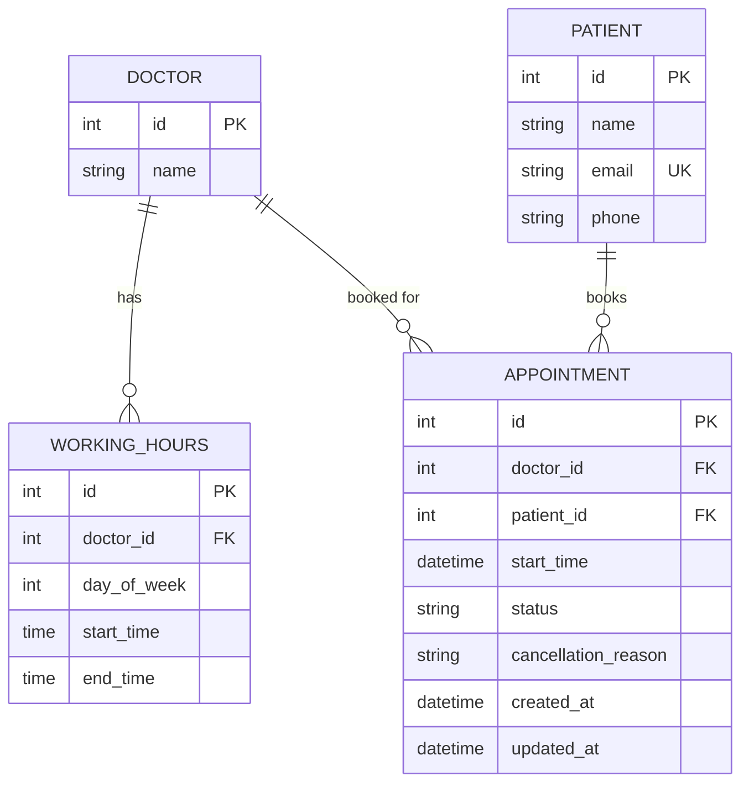

# clinic-booking-api
REST API for a clinic appointment booking system. Built with FastAPI and PostgreSQL, deployed on GCP Cloud Run. Savannah Informatics Backend Developer Take-Home Assessment.

## System design

This system serves a single small clinic with five doctors. Patients look up a doctor's open slots for a given day, book one, and can cancel or move it later. Once a slot is booked, no one else can take it until it is cancelled.

### Framework choice

The assessment accepted three stacks: FastAPI, Django REST Framework, or Go.

Django REST Framework is the stronger fit when a project needs Django's admin interface, a complex web of ORM relationships, or an existing Django codebase to extend. This is a greenfield REST API with no admin surface and a deliberately small set of models, so none of those apply. FastAPI is the better fit for a pure API: it is async-first, it has Pydantic integrated directly for request and response validation, and it generates OpenAPI documentation automatically from the route definitions.

Go is Savannah Informatics' primary backend language, confirmed on their public GitHub organisation. It was not the choice for this submission, and that is worth stating plainly: FastAPI is where documented production experience exists. Go is acknowledged here as a genuine learning priority, not a gap being hidden behind a framework substitution.

Docker containerisation keeps the deployed service portable regardless of the language it is written in, which matters if this API ever needs to sit alongside Savannah's existing Go services in the same infrastructure.

### Entities

**Doctor**
- id
- name

**WorkingHours**
- id
- doctor_id (foreign key to Doctor)
- day_of_week (0 for Monday through 6 for Sunday)
- start_time (time of day)
- end_time (time of day)

One row per day a doctor works. A day with no row means the doctor does not work that day. This is a deliberate choice over a single start and end pair on Doctor, since a single pair cannot express a doctor being off on Sundays or working shorter hours on Saturdays, something almost any real clinic needs.

**Patient**
- id
- name
- email (unique)
- phone

No authentication. Nothing in the assessment requires patient login, and adding it would be scope the brief did not ask for. Patient exists as its own table, rather than storing name and contact details directly on Appointment, specifically so the bonus endpoint, GET /patients/{id}/appointments, has something to reference, and so authentication can be added later as a purely additive change. See Future considerations.

**Appointment**
- id
- doctor_id (foreign key to Doctor)
- patient_id (foreign key to Patient)
- start_time (timestamp with time zone)
- status (booked, cancelled)
- cancellation_reason (nullable, set on cancel)
- created_at, updated_at

end_time is not stored. It is derived at query and response time as start_time plus 30 minutes, since slot duration is currently a fixed, system-wide constant. Storing it would only duplicate that fact and open a class of bugs where the two values disagree. See Future considerations for the one case where this would change.



### Availability derivation

Availability for a doctor on a date is computed, not stored. The service looks up WorkingHours for that doctor and day of week, generates the 30-minute grid between start and end, and removes any time already covered by a booked Appointment for that doctor on that date. There is no persisted Slot table. A pre-generated table needs something to create its rows ahead of time and keep them synchronised with WorkingHours whenever a schedule changes, which is a second source of truth that can drift from the first. Deriving on the fly has no generation step and cannot drift, since it always reads directly from the two tables that are actually authoritative.

### Preventing double booking

This is the one place a plain application-level check is not good enough. Checking availability with a SELECT and then running an INSERT leaves a window where two concurrent requests can both pass the check before either commits. The system closes that window with a database constraint rather than an application-only rule:

```sql
CREATE UNIQUE INDEX uq_appointment_doctor_slot
ON appointments (doctor_id, start_time)
WHERE status = 'booked';
```

The index is partial, restricted to booked rows, so a cancelled appointment does not block the same slot from being booked again. The application still runs a friendly pre-check first so ordinary conflicts return a clean message, but the index is the actual guarantee: if two requests reach the database at the same instant, one commits and the other raises a constraint violation, which the service layer catches and returns as 409 Conflict.

Cancel sets status to cancelled, which removes the row from the index's covered set and frees the slot with no separate step. Reschedule updates start_time on the same row in place, so the same index validates the new time in the same operation. Neither needs a separate slot object to update.

### Reschedule and status

Reschedule changes start_time on the existing appointment row. It does not create a new row and does not need a third status value. The endpoint is a PATCH on the same id and the assessment describes it as moving an appointment, which points to an in-place update rather than cancel and rebook. Status is limited to two values, booked and cancelled. A third value such as rescheduled was considered and rejected: a rescheduled appointment must be treated identically to a freshly booked one everywhere in the system, the availability calculation, the unique index, cancellation eligibility, so a separate status would carry no behavioural difference, only a cosmetic one. That information belongs in a history log if it is ever needed, not in the status column of the live row. See Future considerations.

### HTTP status codes

404 for a doctor, patient, or appointment id that does not exist. 400 for a request that is well formed but breaks a business rule, outside working hours, in the past, inside the 1 hour buffer. 409 for a conflict with existing state, slot already booked, appointment already cancelled. 422 is left to FastAPI's automatic request body validation, so it is never mixed up with the application's own business rule errors.

### Time zone handling

All datetime columns use PostgreSQL's timestamp with time zone type, which stores every instant in UTC internally regardless of what offset the client sends. Kenya does not observe daylight saving time, so this clinic will never hit the specific bug class of an appointment landing on a clock change that does not exist, but that is not the reason for the choice. The reason is that the application server, the database, and any future integration will not all necessarily agree on a single local time zone, and storing everything as UTC removes that ambiguity for free rather than requiring every part of the system to separately track which zone a naive timestamp was written in.

### Deliberately out of scope

A few things were left out on purpose rather than by oversight.

- No Clinic or Location entity. The scenario describes one clinic. Multiple locations are not modelled.
- No specialty field on Doctor. Nothing in the assessment calls for it.
- No audit history of appointment changes. Reschedule overwrites the previous start_time. See Future considerations.
- No patient authentication. See Future considerations.

### Future considerations

**Scaling availability reads.** The current derivation does not get slower as more doctors or more historical appointments are added, since the query is bounded by index performance either way. The actual scaling concern is request volume against the same hot doctor and date, many patients checking the same day at once, which is best solved with a short lived cache, for example Redis, keyed by doctor and date and invalidated on any booking, cancellation, or reschedule for that key, rather than a pre-generated slot table. A pre-generated table would not remove the underlying synchronisation problem, it would only move it behind a table that also has to be kept current. A persisted slot or resource model would become genuinely justified if the domain grows to need it directly, for example multi resource bookings that need a doctor and a room and equipment together, which is a different trigger than raw read volume.

**Patient authentication.** A health system API would standardly sit behind OAuth2 or OpenID Connect, specifically SMART on FHIR conventions given Savannah Informatics' FHIR and HL7 context, with a patient facing token scoped so it can only read that patient's own records. Because Patient already exists as its own table, this is additive: an external auth subject id column on Patient, an authentication dependency at the FastAPI layer, and no change to Doctor, WorkingHours, or Appointment.

**Appointment history.** If an audit trail becomes necessary, the proportionate design is a dedicated AppointmentHistory table, appointment id, action of created, rescheduled, or cancelled, previous start time, new start time, reason, timestamp, rather than a generic cross table audit log, since it is directly queryable for a single appointment's timeline and the actions map exactly to the endpoints that already exist. Each reschedule or cancel would insert one history row in the same transaction as the update. This does not require restructuring Appointment itself.

**Variable appointment duration.** If the clinic ever needs different visit lengths, for example a longer new patient consultation against a shorter follow up, start_time plus a fixed 30 minutes stops being sufficient and end_time, or a duration field, would need to be stored as an independent fact per appointment. That change would also require replacing the exact start time unique index with a PostgreSQL range exclusion constraint on doctor and a start and end interval, since two different length appointments can overlap without sharing an identical start time.

**Status enum validation.** Status values are validated by the Python enum at the ORM layer only; a raw SQL statement that bypasses the application would not be checked, and a database level CHECK constraint was deliberately omitted, since enforcing one would mean manually dropping and recreating a named constraint on every future migration that changes the status value set, the exact kind of change already discussed in Reschedule and status above.